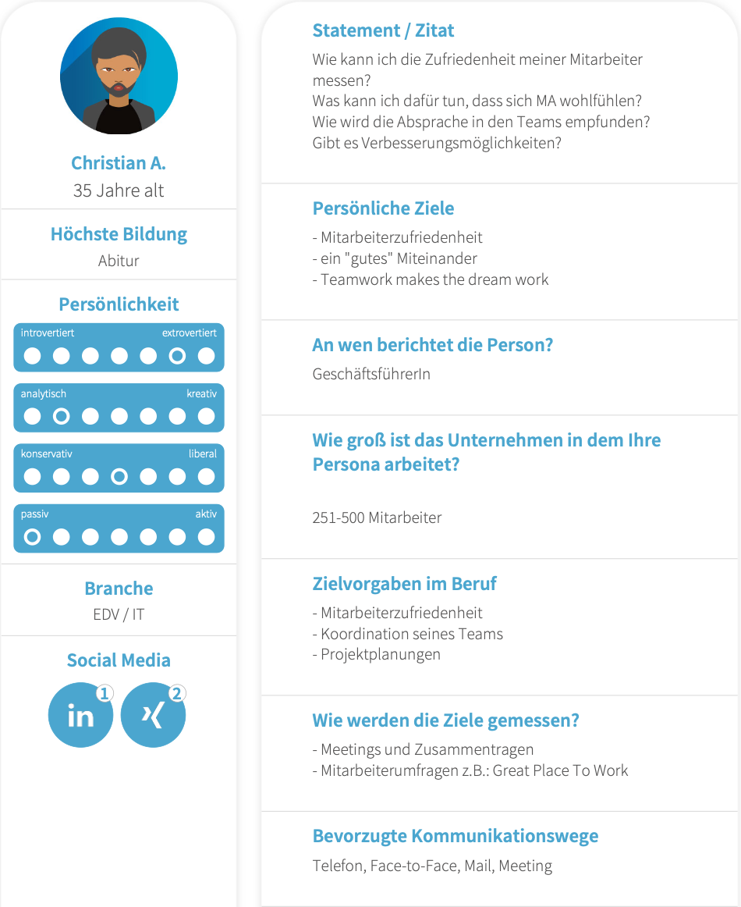

{: .label }
Nurdan Turan

{: .label }
Berkay Olmaz

{: .no_toc }
# Value proposition

{: .text-delta }

Table of contents

+ ToC
{: toc }

## The problem

Umfrageplattformen möchten meist viele Informationen sammeln. Die Nutzer müssen sich registrieren und verlieren Zeit, die sie besser nutzen könnten. Es werden überflüssige Daten erwünscht und die Auswertung ist unüberischtlich und nur auf der Webseite zu finden.

## Our solution

Wir haben uns dazu entschieden eine Umfrageplattform zu schaffen, bei der keine Anmeldung nötig ist um eine schnelle einfache Umfrage zu erstellen. Die Anmeldung ist optional und dient nur der Übersicht für den Nutzer. Außerdem hat dieser die Möglichkeit, die gesammelten Informationen als CSV Datei zu exportieren.

## Target user

## Customer journey

[Illustrate the customer journey, from the app's entry point to a completed task. You might want to show the customer journey as (schematic) screen flows.]
