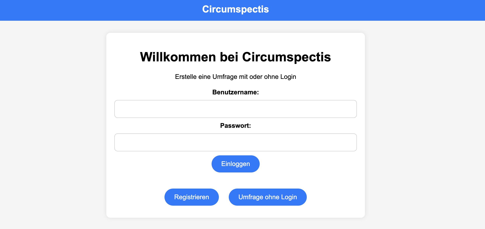
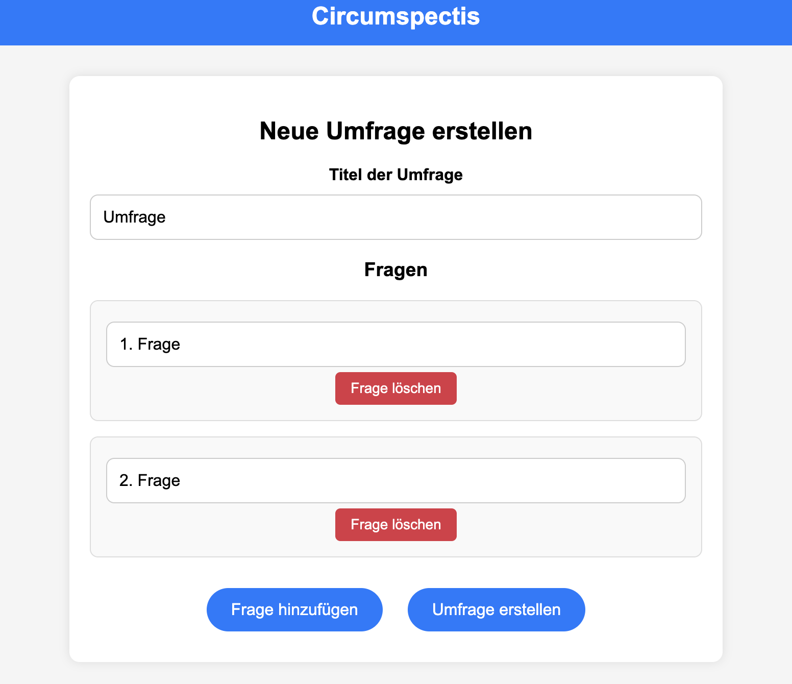
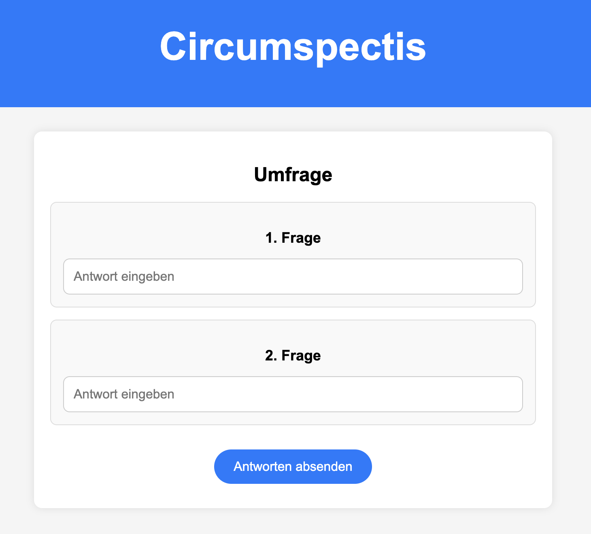
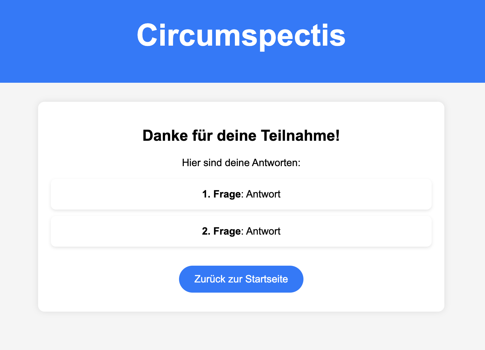
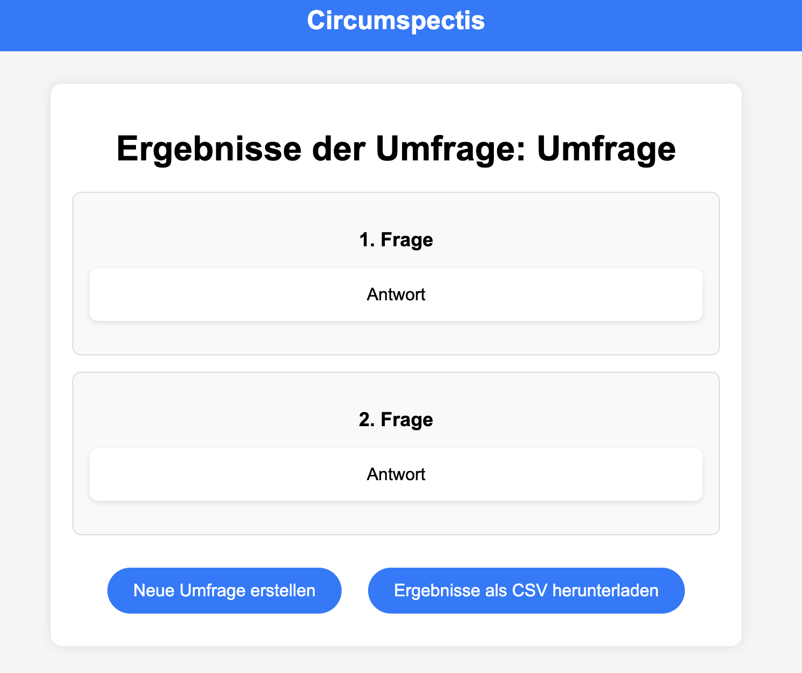
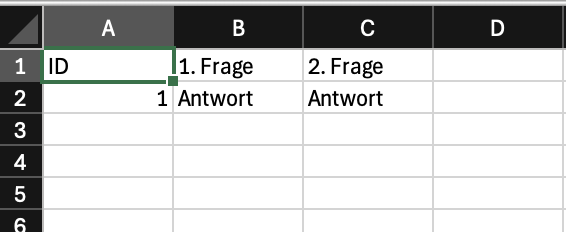

{: .label }
Nurdan Turan

{: .label }
Berkay Olmaz

{: .no_toc }
# Value proposition

{: .text-delta }

Table of contents

+ ToC
{: toc }

## The problem

Umfrageplattformen möchten meist viele Informationen sammeln. Die Nutzer müssen sich registrieren und verlieren Zeit, die sie besser nutzen könnten. Es werden überflüssige Daten erwünscht und die Auswertung ist unüberischtlich und nur auf der Webseite zu finden.

## Our solution

Wir haben uns dazu entschieden eine Umfrageplattform zu schaffen, bei der keine Anmeldung nötig ist um eine schnelle einfache Umfrage zu erstellen. Die Anmeldung ist optional und dient nur der Übersicht für den Nutzer. Außerdem hat dieser die Möglichkeit, die gesammelten Informationen als CSV Datei zu exportieren.
--- 
## Target user

Um uns nicht an einer ganz bestimmten Zielgruppe festzulegen, haben wir uns entschieden zwei Personas zu erstellen.

### Persona 1: Student S

Diese Persona ist ein 20- bis 40-jähriger Nutzer aus der IT-Branche. Er ist analytisch, eher konservativ und leicht introvertiert. Sein Hauptziel ist es, gezielt und zeitsparend Informationen zu erhalten. Außerdem legt er Wert auf Reichweite und Informationssammlung, wobei er seine Ziele anhand von Analysen bewertet. Er bevorzugt digitale Kommunikationswege wie z.B.: E-Mail und Social Media, Facebook und LinkedIn. Da er sich auch größtenteils über die Medien informiert, ist er an strukturierten und leicht zugänglichen Daten interessiert. 

Die Umfrageplattform bietet ihm eine einfache Möglichkeit, relevante Informationen zu sammeln, Ergebnisse effizient auszuwerten und sie als CSV-Datei herunterzuladen. Da er ohne Login Umfragen erstellen kann, ist die Nutzung für ihn besonders zeitsparend und unkompliziert.

### Persona 2: Christian A.

Christian A. ist 35 Jahre alt und arbeitet als Teamleiter in einem mittelgroßem IT-Unternehmen mit 251-500 Mitarbeitern. Sein Team besteht aus 6 Personen und sein Fokus liegt auf Mitarbeiterzufriedenheit, Teamkoordination und Projektplanung. Er nutzt Umfragen, um Feedback seiner Mitarbeiter zu sammeln um so Optimierungspotenziale zu erkennen. 

Die Plattform kommt ihm entgegen, da sie einfache Umfrageerstellung bietet und Ergebnisse übersichtlich auswertet. Besonders schätzt er die Möglichkeit, die Ergebnisse als CSV-Datei herunterzuladen, um sie in Meetings oder Analysen zu verwenden. Er bevorzugt direkte Kommunikation per Telefon, E-Mail, Teams oder Meetings.

---
## Customer journey

### Startseite

Die Customer journey beginnt mit der Startseite. Hier hat der Nutzer die Auswahl sich zu registrieren bzw. einzuloggen oder eine Umfrage ohne Login zu erstellen.

### Dashboard

Hat der Nutzer sich eingeloggt, kann dieser seine Umfragen sehen und diese Auswertung anzeigen lassen (survey), eine neue Umfrage erstellen oder sich ausloggen.

### Create

Möchte der Nutzer eine Umfrage erstellen, so muss er einen Titel für die Umfrage angeben und kann dann Fragen hinzufügen oder löschen.

### Created

Wurde die Umfrage erstellt, erhält der Nutzer umgehend einen Link, welchen er per klick auf "Link kopieren" kopieren und somit weiterleiten kann. Weiterhin kann er auf die Seite der Ergebnisse wechseln.

### Survey

Der Link zu der Umfrage führt zu der survey.html und kann dann durch einen Nutzer beantwortet und abgesendet werden.

### Submitted

Wurde die Umfrage ausgefüllt und abgesendet, wird dem Absender seine Antworten angezeigt. Dieser kann dann durch einen weiteren Klick auf die Startseite wechseln.

### Results 

Die Antworten kann der Ersteller auf der results.html einsehen. Durch aktualisieren der Seite, können alle Ergebnisse neu geladen werden. Der Nutzer kann aber auch eine neue Umfrage erstellen oder die Ergebnisse als CSV Datei exportieren.

### CSV-Datei

Die CSV-Datei wird automatisch heruntergeladen und setzt pro Teilnehmer eine ID. Die Fragen werden in der ersten Zeile gesammelt und die Antworten in den jeweiligen Spalten.

